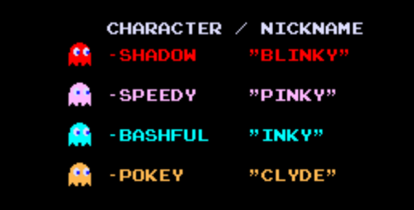
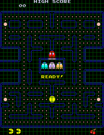
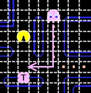
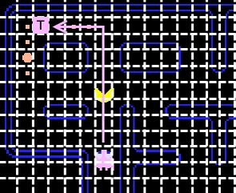
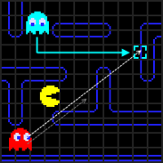
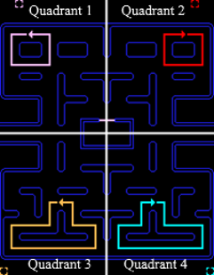
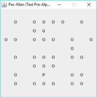

# PUC-MAN
A relic of some of my old work, a Java remake of PAC-MAN by translating the original assembly, and the test version I created using just text

## Overview
Video games are a clear and visual representation of how computing technology has developed over the last 40 years, allowing more intricate graphics platforms to serve as the basis of interactive media. PAC-MAN is a prime example of how a game does not need to be big, extensive or use a sophisticated physics engine to be incredibly popular, despite the limitations of computing technology in 1980. This project looks at how the game works in finer detail so that a remake can utilise a much more usable programming language to extend it even further.

## Aims and Objectives
1.	To analyse the mechanics of PAC-MAN.
2.	To produce a prototype to use as a foundation for the final release version.
3.	To reproduce the original game using libraries natively provided by the Java Development Kit.
4.	To further advance the reproduction using new, inventive mechanics.

## Ghosts and their travel modes
Arguably the most defining point of the game, the four ghosts are the player’s nemesis. Each ghost is named to reflect their personality, describing how they tend to navigate the maze. The game’s introduction screen names each of them in turn

To better understand the principles of the ghosts’ movement, the game’s maze is logically divided into a grid

This grid is the basis of the ghosts’ movement, which is determined by a target tile. Ghost movement is also determined by their “mode”

### Chase
The most important mode, as this is when the ghost is actively attempting to reach Pac-Man, based on some rule. These are outlined below, ordered by complexity.

Blinky's path is the simplest. It only uses the tile currently occupied by Pac-Man as a target (GameInternals, 2010). 
Pinky's target is slightly more intricate. It uses the tile that is exactly four spaces in front of Pac-Man as a target. This is used as an attempt to get ahead of Pac-Man and trap him between Pinky and Blinky.

However, the original game's source code included a bug, caused by the lack of an arithmetic overflow during the calculation of the pat. This would cause Pinky to use the tile that is both four tiles ahead, and four tiles to the left of Pac-Man when he is facing upwards.

Clyde's path can vary. The algorithm used to determine where he goes is based on his proximity to Pac-Man, and can often appear to move quite erratically. If Clyde is within an eight tile radius from Pac-Man's position, he will simply use his target tile as though he were in Scatter mode, and move towards Quadrant 3 of the maze (see “Scatter” mode). However, when outside of this radius, he uses the same algorithm as Blinky, and will simply head to wherever Pac-Man currently resides. 
Inky is the most complex of the four ghosts. Its path and target are dependent on Blinky's current position in relation to Pac-Man, and so does not produce his own unique path, but rather derives one based on this notion. Inky starts by taking the space that is two tiles in front of Pac-Man, in a similar fashion to Pinky. Secondly, the game draws a logical line from Blinky's position to this tile, and multiplies its length by two. The tile where this line ends is used as Inky's target.

Inky also suffers from the same overflow bug as Pinky, and will use the space two tiles to the left and above Pac-Man when he is facing upwards.

##Scatter
Since the ghosts are not always hunting the player and can sometimes appear to be moving of their own will, the Scatter mode determines their movement otherwise. Each ghost has a standard target tile that does not change throughout the entirety of the game and is used to assign one ghost to each quadrant of the maze.

By continuously attempting to find a path to a tile they cannot reach, the ghosts are constrained to moving in a circle in their designated quadrants.

### Frightened
This is the state that reflects when the player has eaten a Power Pellet and the ghosts are edible. They do not find any particular path while in this state, and instead use a pseudo-random number generator to decide on a new direction, should they reach an intersection.

## Text Version and Design
“PUC-MAN” is the name of the PAC-MAN remake. It is derived from PAC-MAN’s original name, “PUCK-MAN” (meaning “chomp” in Japanese), which was changed do to fear of vandalism when the game released outside of Japan.

PUC-MAN has been made purely using the Java Development Kit version 8, mainly employing the Abstract Window Toolkit (AWT) and Swing packages and written using the Eclipse Neon IDE. The aim was to use only the libraries natively provided by the JDK (though there are few exceptions to this, as there were some forms of media and peripherals Java doesn't natively support). The text version of the game is drawn onto a standard Swing JFrame in the “TextGameFrame” class, using a 2D array of JLabel objects to show the maze walls (O), player (P), and a single ghost (G).

